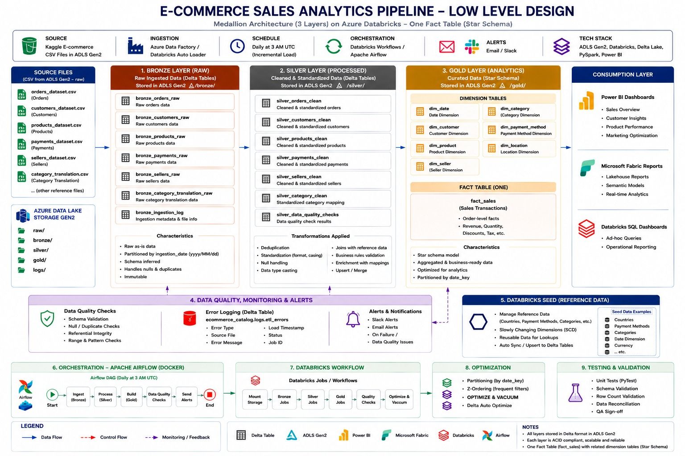
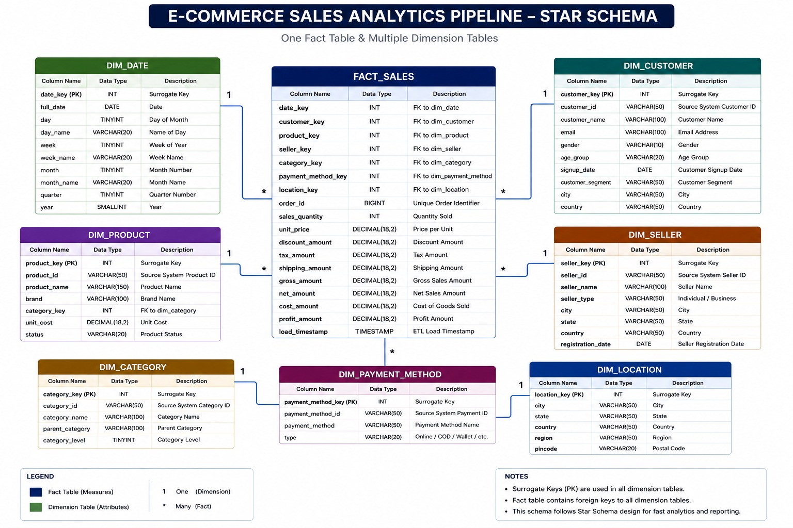
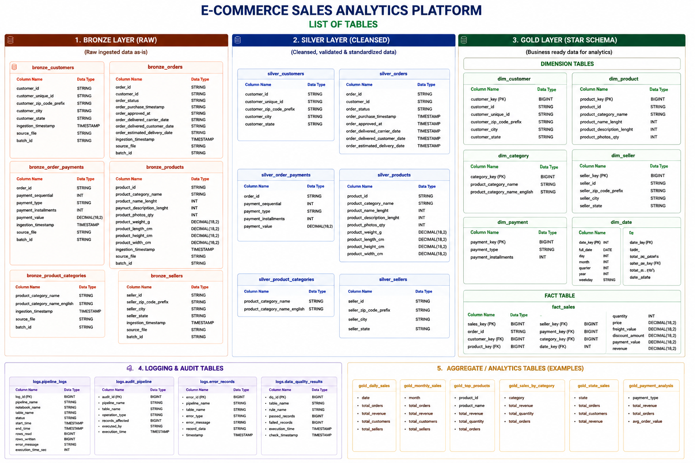

# E-Commerce Sales Analytics Platform

## Project Overview

This project demonstrates an end-to-end Enterprise Data Engineering ETL Pipeline using Azure, Azure Databricks, Delta Lake, Apache Airflow (Docker), and Microsoft Fabric. The pipeline ingests raw e-commerce datasets stored in Azure Data Lake Storage Gen2 (ADLS Gen2), processes them using the Medallion Architecture (Bronze, Silver, and Gold layers), and delivers business-ready data for analytics and reporting.

---

## Business Problem

Organizations receive large volumes of e-commerce transactional data from multiple sources. Processing this raw data into reliable, analytics-ready datasets requires scalable storage, automated ETL pipelines, data quality validation, orchestration, logging, and business intelligence reporting.

This project builds an enterprise-grade ETL pipeline to solve these challenges.

---

## Technology Stack

| Category | Technology |
|----------|------------|
| Cloud Platform | Microsoft Azure |
| Storage | Azure Data Lake Storage Gen2 |
| Processing | Azure Databricks |
| Language | Python, PySpark |
| Data Format | Delta Lake |
| SQL Engine | Databricks SQL |
| Orchestration | Databricks Workflows, Apache Airflow (Docker) |
| Version Control | Git & GitHub |
| Testing | Pytest |
| Monitoring | Logging & Audit Framework |
| Reporting | Microsoft Fabric |

---

# High Level Design (HLD)

---

# Low Level Design (LLD)

---

# Star Schema Data Model

---

# List of Tables

---

# Author

**Sakshi Bejagmwar**